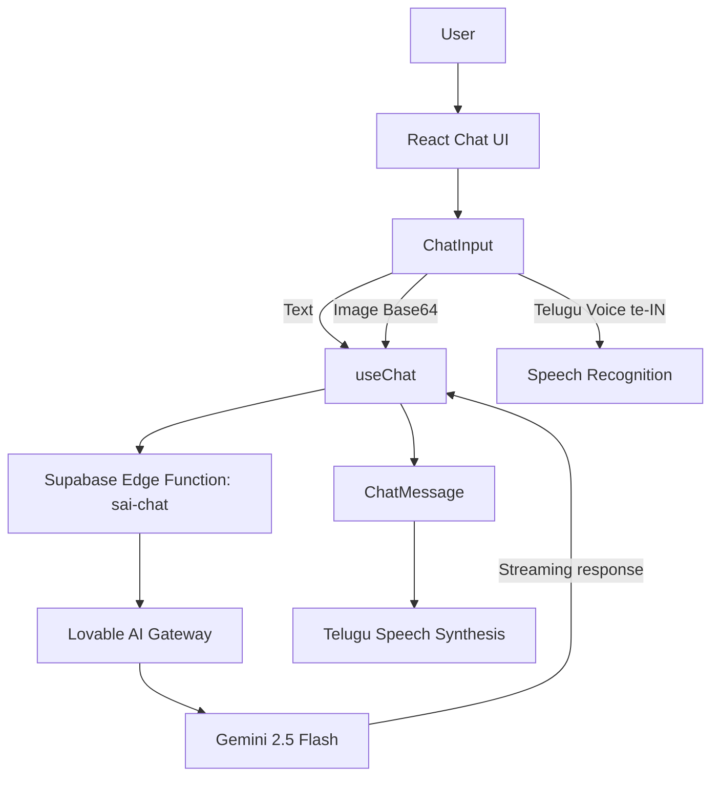

# SAI-GPT

**SAI-GPT** is a React-based AI chat application focused on **Telugu-first interaction**. The current implementation supports text chat, Telugu voice input, image input, streamed AI responses, and Telugu text-to-speech output.

The application is presented as **SAI-GPT by Devoote**.

## What the application does

- Text-based questions and answers
- Telugu voice input
- Image upload for image-aware prompts
- Streaming assistant responses
- Telugu speech output for assistant responses
- Conversation clearing
- Send/receive/pop interface sounds
- Welcome screen showing the supported input modes

## User flow

```text
                         SAI-GPT
                            |
              +-------------+-------------+
              |             |             |
           Text Chat    Telugu Voice    Image
              |             |             |
              +-------------+-------------+
                            |
                            v
                     Supabase Edge Function
                          sai-chat
                            |
                            v
                    Lovable AI Gateway
                            |
                            v
                    Gemini 2.5 Flash
                            |
                            v
                    Streaming response
                            |
              +-------------+-------------+
              |                           |
          Chat message               Telugu speech
              |                           |
              v                           v
         ChatMessage                  SpeechSynthesis
```

## Main features

### Text chat

`ChatInput.tsx` accepts normal text messages. Enter submits unless Shift is held, allowing multi-line input.

### Telugu voice input

The microphone control uses browser `SpeechRecognition` / `webkitSpeechRecognition`.

The current code sets:

```text
te-IN
```

so the browser recognizer is asked to interpret speech as Telugu. The transcript is inserted into the chat input before sending.

### Image input

The image picker accepts image files and checks that the file is an image and is no larger than **5 MB**. The image is converted to a Base64 data URL and attached to the request.

### Streaming responses

The `sai-chat` Supabase Edge Function requests a streaming completion from the Lovable AI Gateway. The frontend reads the streamed `data:` chunks and updates the assistant message incrementally.

Completed sentences are also placed into a speech queue.

### Telugu assistant behavior

The current backend system prompt instructs the assistant to:

- respond only in Telugu
- use simple Telugu understandable to children
- begin with a friendly greeting
- explain deity forms, weapons and powers
- tell popular stories
- discuss festivals and पूजा
- provide interesting child-friendly facts
- avoid Markdown markers such as `**`, `##`, and `---`

The current prompt specializes the assistant around Telugu explanations of Hindu mythology and spiritual topics.

### Telugu text-to-speech

The browser `SpeechSynthesis` API is used for assistant responses.

The speech helper searches installed browser voices for Telugu and prefers a Telugu voice when available. Responses are split into sentences/lines and spoken sequentially.

### Image-aware requests

The backend accepts optional `imageBase64` content and sends both text and image content to the AI gateway when an image is attached.

### Interface sounds

`useSoundEffects.ts` creates short Web Audio oscillator sounds for send, receive, and pop events.

## Important implementation files

| File | Responsibility |
|---|---|
| `src/App.tsx` | App shell, routing and providers |
| `src/pages/Index.tsx` | Main chat screen and layout |
| `src/components/WelcomeScreen.tsx` | Initial welcome/features screen |
| `src/components/ChatInput.tsx` | Text, voice and image input |
| `src/components/ChatMessage.tsx` | Message rendering and Telugu speech control |
| `src/components/TypingIndicator.tsx` | Assistant loading state |
| `src/hooks/useChat.ts` | Chat requests, stream parsing and speech queue |
| `src/hooks/useSpeech.ts` | Browser Telugu text-to-speech |
| `src/hooks/useSoundEffects.ts` | Web Audio feedback |
| `supabase/functions/sai-chat/index.ts` | Backend chat endpoint and AI gateway call |
| `src/assets/divine-background.jpg` | Main chat background used by the page |
| `src/assets/yoga-avatar.png` | SAI-GPT assistant avatar |

## AI request flow

The browser sends chat data to:

```text
SUPABASE_URL/functions/v1/sai-chat
```

The Edge Function:

1. reads `messages` and optional `imageBase64`
2. checks `LOVABLE_API_KEY`
3. creates the Telugu system prompt
4. prepares text and optional image content
5. calls the Lovable AI Gateway
6. requests a streaming completion
7. returns the stream to the browser

The current backend model configured in `sai-chat/index.ts` is:

```text
google/gemini-2.5-flash
```

## Visual assets actually used by the code

The repository already contains the assets referenced by the UI:

- `src/assets/divine-background.jpg` — full-screen chat background
- `src/assets/yoga-avatar.png` — assistant avatar

These are linked in the application source, so no made-up screenshots are required for the README.

## Technology stack

- React 18
- TypeScript
- Vite
- React Router
- TanStack React Query
- Supabase JavaScript client
- Supabase Edge Functions
- shadcn/ui
- Radix UI
- Tailwind CSS
- Sonner
- Zod
- Browser Speech Recognition API
- Browser Speech Synthesis API
- Web Audio API

## Run locally

```bash
git clone https://github.com/pallasivasai/sai-gpt.git
cd sai-gpt
npm install
npm run dev
```

The Supabase project configuration used by the repository must be available, and the Edge Function expects:

```env
LOVABLE_API_KEY=your_key
```

## Current implementation notes

- Voice input depends on browser support for SpeechRecognition/webkitSpeechRecognition.
- Telugu speech output depends on a suitable Telugu speech-synthesis voice being available.
- Client-side image input is limited to 5 MB.
- The backend streams the AI response.
- The current system prompt is specialized around Telugu spiritual / Hindu mythology explanations rather than being a general unrestricted chatbot.

## Links

- [GitHub Repository](https://github.com/pallasivasai/sai-gpt)


## 🏗️ Architecture



This diagram reflects the current React components, browser speech/image handling, Supabase Edge Function, AI gateway, streaming response, and Telugu speech output documented by the repository.
